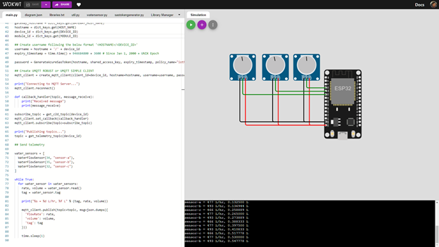
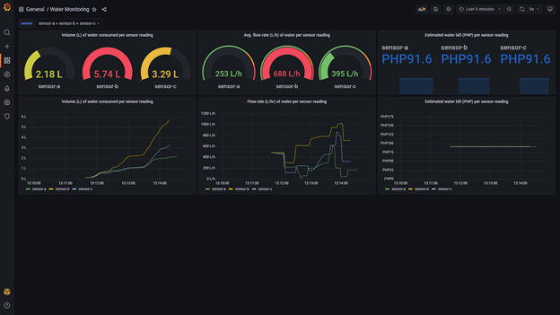

# water-monitoring-iot

A project that demonstrates a water monitoring system proof-of-concept using internet of things (IoT).

## Usage

-   Assuming Docker is installed, perform `docker-compose up` to start the Grafana and InfluxDB service.
-   This project's Grafana dashboard model is available in `grafana/model.json`.
-   Copy the `.env.example` to `.env` and tailor it to your configuration.
-   Assuming Node is installed, use `npm run start` to start the Node.js server to stream IoT Hub data to InfluxDB.

## Technical Details

This project uses [Microsoft Azure IoT Hub](https://azure.microsoft.com/en-us/services/iot-hub/). An ESP32 IoT device, simulated from [wokwi](https://wokwi.com/) and running [MicroPython](https://micropython.org/), is sending water consumption data through the Message Queuing Telemetry Transport (MQTT) protocol. Basic potentiometers are used to emulate [YF-S201](http://www.mantech.co.za/datasheets/products/yf-s201_sea.pdf) water flow sensors.

A Node.js server is configured to read the messages sent to the IoT Hub's event hub. This server processes the data to convert some units and compute the estimated water bill. It sends the processed data to InfluxDB. Grafana uses InfluxDB as its primary datasource to create a dashboard.

The dashboard showcases the flow rate (L/h) of water, volume (L) of water consumed, and estimated water bill (PHP).

## References

-   This project was based on this Microsoft [article](https://docs.microsoft.com/en-us/azure/iot-hub/iot-hub-live-data-visualization-in-web-apps) and [repository](https://github.com/Azure-Samples/web-apps-node-iot-hub-data-visualization).

-   The Manila Water Company, Inc. (MWCI) [tariff table](https://www.manilawater.com/laravel-filemanager/files/9/east-zone-manila-concession/ckeditor-files/20190109024432_MWCI%202019%20Standard%20Rates%20Tariff%20Table-signed_FA.jpg) is used to compute estimated water bills.
